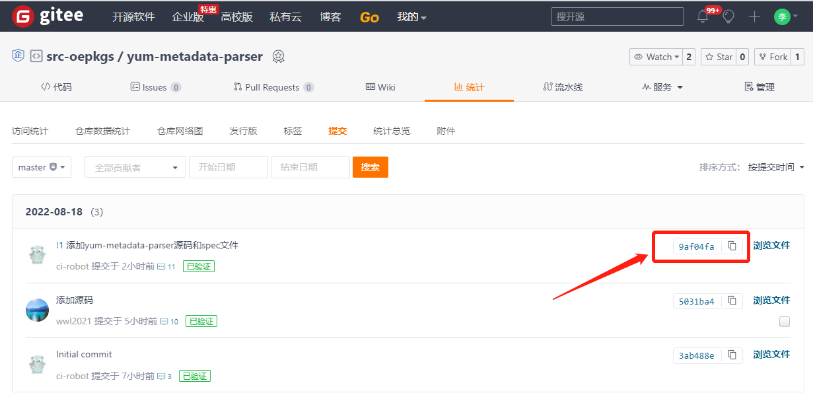
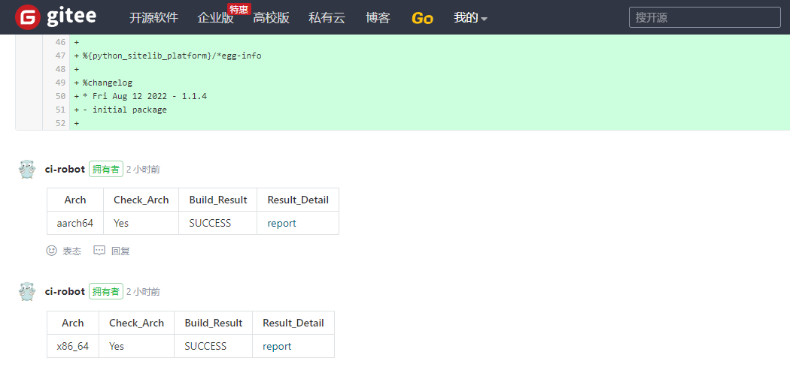
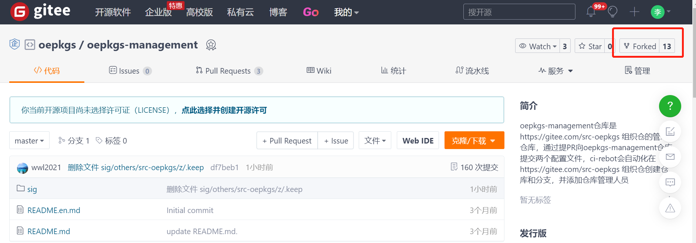

#### 一、基于PR，创建仓库
在[oepkgs-management](https://gitee.com/oepkgs/oepkgs-management)仓库提PR(如何提PR，详见文档最后的[QA](##QA))，填写两个配置文件，PR合入之后，创仓机器人ci-rebot会在[src-oepkgs](https://gitee.com/src-oepkgs)下面自动创建仓库。

oepkgs-management仓库中的两个配置文件(以qemu为例)：
```
# 在oepkgs-management仓库sig目录下面创建虚拟化领域的sig组
# 创建oepkgs-management/sig/virtual/sig-info.yaml文件
oepkgs-management/sig/virtual/sig-info.yaml:

# sig组名称，一般跟软件包领域相关
name: virtual
description: "To support the field of virtual"
mailing_list: NA
meeting_url: NA
mature_level: startup
# sig组的管理者
maintainers:
- gitee_id: lipingEmmaSiguyi
  name: Ping Li
  orgnization: Huawei
  email: liping136@huawei.com
# 该sig组管理的仓库
repositories:
- repo: 
  - src-oepkgs/qemu   
```

```
# 在oepkgs-management/sig/virtual下面创建src-oepkgs/仓库名称首字母/仓库名称.yaml
# ci-rebot将依据这个文件进行自动建仓
oepkgs-management/sig/virtual/src-oepkgs/q/qemu.yaml:

# 仓库名称
name: qemu
description: "QEMU is a generic and open source processor emulator which achieves a good emulation speed by using dynamic translation"
# 仓库地址
upstream: https://gitee.com/src-oepkgs/qemu
# 仓库分支
branches:
- name: master
  type: protected
- name: openEuler-20.03-LTS-SP3
  type: protected
  create_from: master
- name: openEuler-22.03-LTS
  type: protected
  create_from: master
type: public
```
#### 二、补充源码文件
完成步骤一之后，5分钟内会生成https://gitee.com/src-oepkgs/qemu仓库，通过PR往这个仓库中补充源码文件：

分别是可用于支撑生成rpm包的qemu.spec文件、软件包源码包qemu-2.12.0.tar.bz2，详见：https://gitee.com/src-oepkgs/qemu

提了PR之后，在5~30分钟时间内，会进行PR门禁构建测试，PR会评论出PR构建结果，建议在**Build_Result**显示为**SUCCESS**之后合入PR


前面配置文件oepkgs-management/sig/virtual/sig-info.yaml中指定的maintanier，可通过在PR下面评论/lgtm及/approve合入PR


PR合入之后会在合入的commit下面给出构建测试结果，以及安装测试结果，以及软件包上传到目标内部测试仓库**testing_repo**中,如果测试结果成功，第二天会更新至**oepkgs_reop**中(注：oepkgs仓库每日零点定时更新，测试结果中只是给出预计要存放的oepkgs仓库地址)：






-------------------------------------------
**接下来的动作都是基于compass-ci构建系统自动完成，属于原理解析，无需用户操作，但如果你想更加清楚的了解软件包构建进展，可继续阅读。**
#### 三、基于webhook，自动触发构建任务原理

1. 仓库的webhook将自动触发提交构建任务
2. 查看日志判断是否构建成功
3. 构建成功则会自动进行安装测试，若成功则入库
4. 构建/安装测试失败则查看日志分析原因并进行修复

####  1. webhook自动提交构建rpm包构建任务
`submit rpmbuild.yaml (rpmbuild.yaml是包构建任务的配置参数文件)`
```
# 测试用例名称
suite: rpmbuild
# 测试用例 ~/lkp-test/tests/rpmbuild
rpmbuild:
# 远程仓库源码包地址
upstream_repo: https://gitee.com/src-oepkgs/qemu
# 构建后的包仓库位置，都将放置在contrib/$sig仓库中
custom_repo_name: contrib/virtual

# 测试机为虚拟机时:
testbox: vm-2p8g
arch:
  - aarch64
  - x86_64
os: openeuler
# 这个参数由源码文件合入的仓库分支决定
os_version: $upstream_branch

# 测试机为容器时:
# testbox: dc-8g
# arch:
#  - aarch64
#  - x86_64
# docker_image: $upstream_branch
```
#### 2. 查看日志判断是否构建成功
###### 2.1 可通过job_id来查看日志(该job_id之后将由门禁系统，以评论形式评论至仓库PR中，目前暂无)
 <u>https://compass-ci.openeuler.org/jobs</u>


#### 3. rpmbuild脚本
在submit rpmbuild.yaml 时，测试用例**rpmbuild**会去引用脚本
```https://gitee.com/wu_fengguang/lkp-tests/blob/master/tests/rpmbuild```

该脚本会通过rpmbuild.yaml提供的信息进行```rpmbuild -ba *.spec```。

如果构建成功，则通过upload_rpm_pkg函数先将测试机上打好的软件包放入```/srv/rpm/upload```,再通过update_repo_mq处理上传的软件包。处理完的包会先放入/srv/rpm/testing中，每天零点定时更新到/srv/rpm/pub中,也就是https://repo.oepkgs.net/openEuler/rpm/仓库中
#### 4. 测试构建的包能否正常安装
###### 4.1  可以查看job_id(自动构建任务，无需提交,可通过job_id来查看日志,该job_id之后将由门禁系统，以评论形式评论至仓库PR中，目前暂无)
<u>https://compass-ci.openeuler.org/jobs</u>

###### 4.2  手动提交install.yaml
需要加入以下参数

mount_repo_addr: 构建后的包所在仓库地址

mount_repo_name: 仓库分支

srpm_name: 构建好的rpm包,去除.rpm

```
suite: install-rpm
category: functional
install-rpm:
rpm_name: xxxx
os: openeuler
os_version: 22.03-LTS
testbox: vm-2p8g
arch: aarch64
#testbox: dc-8g
#docker_image: openeuler:22.03-LTS
mount_repo_addr: https://api.compass-ci.openeuler.org:20018/rpm/testing/openeuler-22.03-LTS/compatible/c7/aarch64
mount_repo_name: compatible/c7
```

#### 5. 处理自动构建失败的包
###### 5.1 查找原因并修复
可以通过2.1得知构建失败的原因，可在虚拟机/容器中进行重新构建并一步步修复
修复完成的源码以及spec文件重新放入仓库中

# QA

### 如何提PR进行建仓？
在<u>https://gitee.com/oepkgs/oepkgs-management/</u>仓库进行建仓

**1 先将该仓库forked到自己账号的仓库中**


**2 将forked的仓库git clone到本地，新增两个配置文件，git push到forked的仓库中**

**3 将自己仓库的内容Pull requests到企业仓**


### 如何查询软件包位置？
[https://compass-ci.openeuler.org/oepkgs](https://compass-ci.openeuler.org/oepkgs)
可在此查询引入到软件所的软件包

### 如何下载使用仓库中的软件包？
在[https://compass-ci.openeuler.org/oepkgs](https://compass-ci.openeuler.org/oepkgs)
查询软件包在软件所中的仓库存放位置之后，详见[openEuler社区开源软件适配流程.md](https://gitee.com/openeuler/oec-application/blob/master/doc/openEuler%E7%A4%BE%E5%8C%BA%E5%BC%80%E6%BA%90%E8%BD%AF%E4%BB%B6%E9%80%82%E9%85%8D%E6%B5%81%E7%A8%8B.md)的最后一节：**下载使用软件**，修改这一节中的示例中的**baseurl**即可。