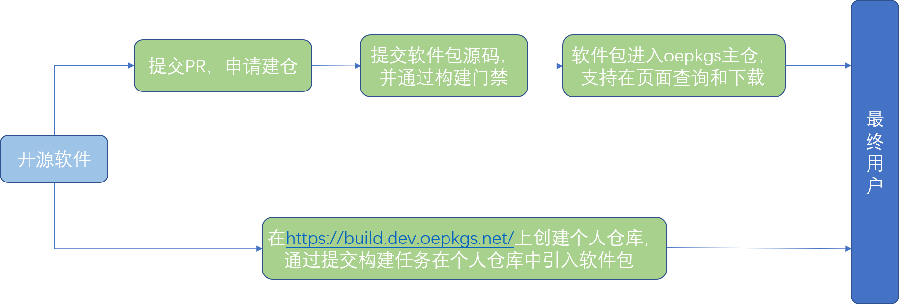
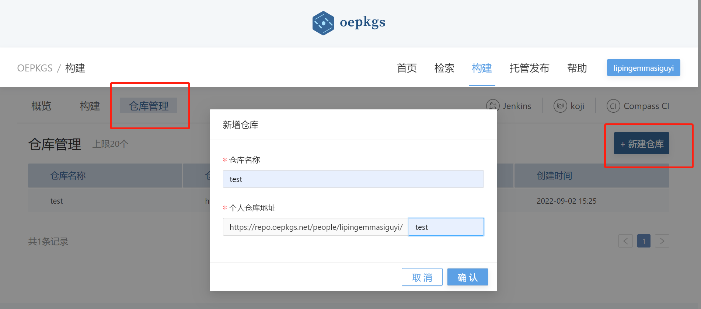
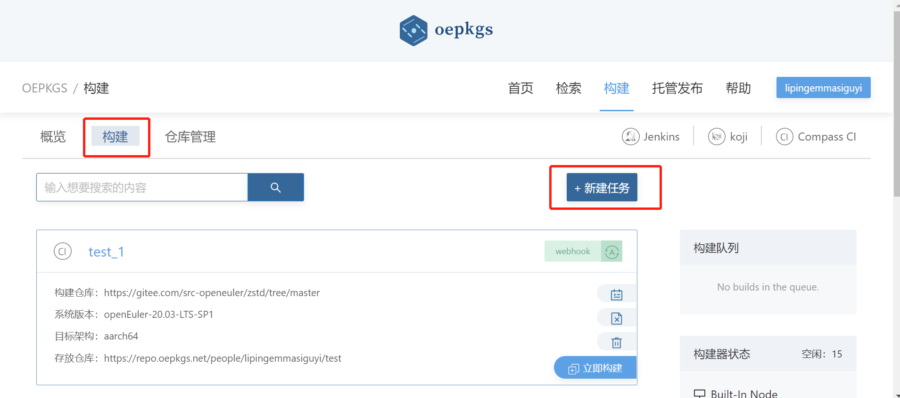
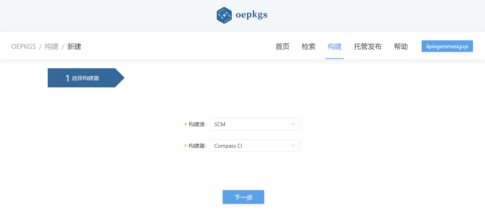
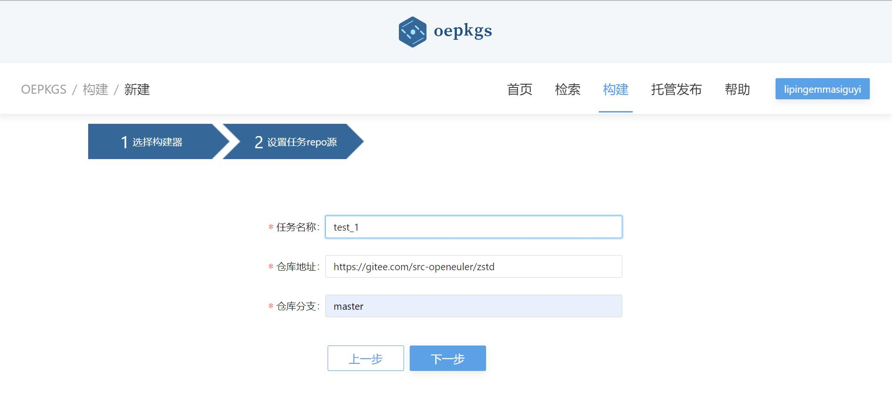
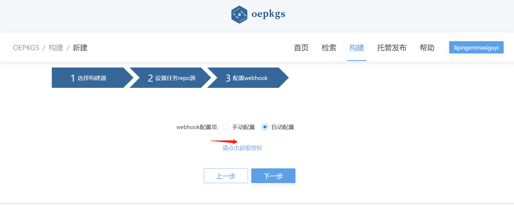
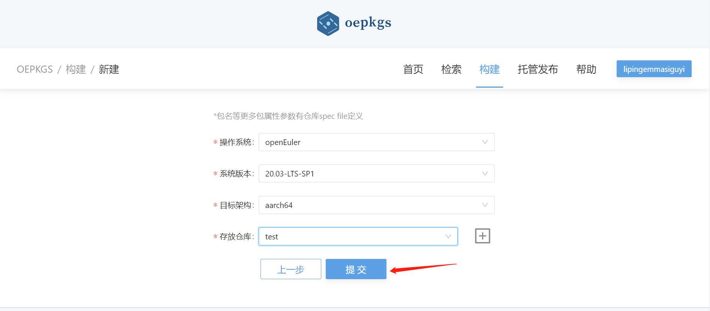
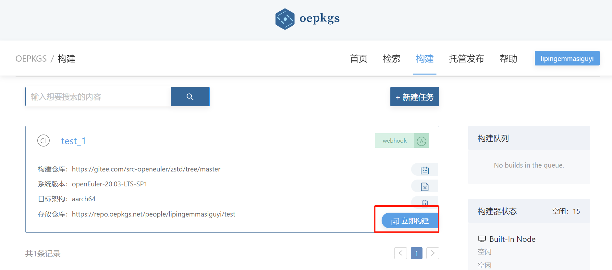
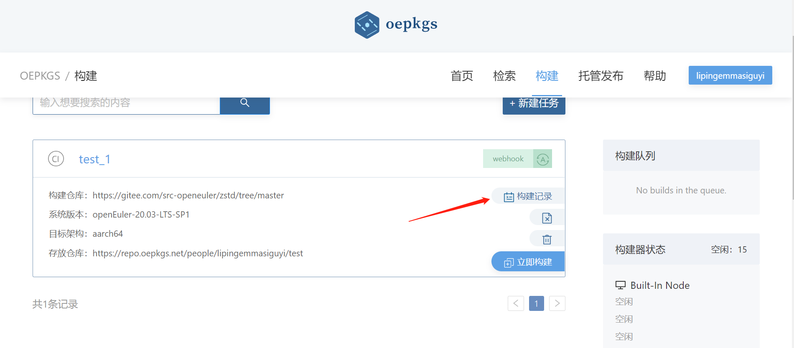
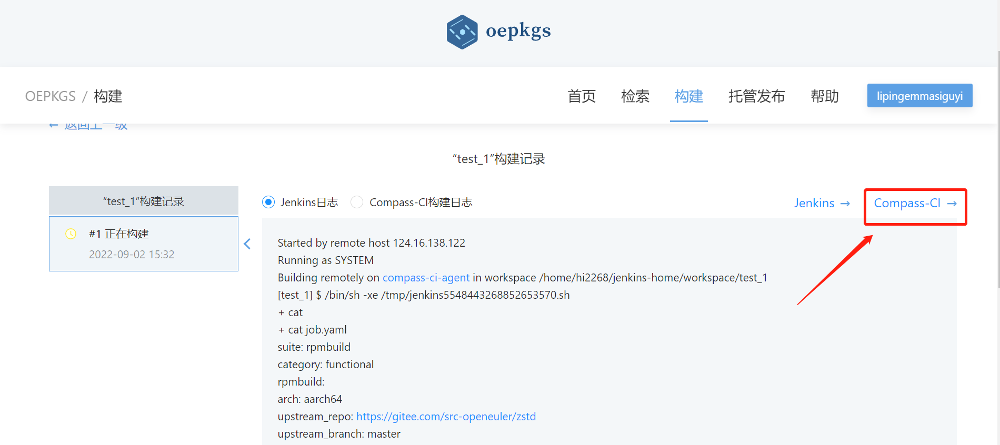

[TOC]

### 背景介绍
[oepkgs](https://oepkgs.net/zh/) 全称开放软件包服务(Open External Packages Service)，是一个为 openEuler 以及其他 Linux 发行版提供软件包服务和容器镜像服务的第三方社区。
oepkgs 社区提供两种开源软件包适配方式，第一种方式开源软件包的源码合入 [src-oepkgs](https://gitee.com/src-oepkgs) 组织仓下面，由 src-oepkgs 的构建服务对软件包进行构建
测试，兼容性测试，并进入 oepkgs 的[主体仓库](https://repo.oepkgs.net/openEuler/rpm/)中。另一种方式用户通过网页快速构建软件包，软件包进入个人账户下面的某个仓库中。



### 开源软件引入oepkgs主仓总体流程
>**1. 初始化RPM编译环境**

>**2. 在openEuler上进行编译构建**

>**3. 在openEuler上进行兼容性测试**

>**4. 使用src-oepkgs社区构建工程**

#### 1. 初始化RPM编译环境
执行命令，安装构建工具：
```
yum install -y dnf-plugins-core rpm-build
```
生成目录结构：
```
# 输入任意 **.spec，这一步报错，此时将自动生成目录
rpmbuild -ba nginx.spec
error: failed to stat /root/nginx.spec: No such file or directory
# 查看自动生成的目录结构
ls ~/rpmbuild/
BUILD  BUILDROOT  RPMS  SOURCES  SPECS  SRPMS
```
准备软件源码到SOURCES
```
wget http://nginx.org/download/nginx-1.20.1.tar.gz
cp nginx-1.20.1.tar.gz ~/rpmbuild/SOURCES/
```
创建修改SPEC配置文件
```
编写后缀为.spec的文件
vim ~/rpmbuild/SPECS/nginx.spec
Name:     nginx
Version:  1.20.1
Release: 10
Summary: Nginx is a web server.
License: GPL
Group:   Productivity/Networking/Web/Proxy
URL:     test.rpm.com
Source0: nginx-1.20.1.tar.gz
BuildRequires: gcc
BuildRequires: pcre2-devel
BuildRequires: pcre-devel
BuildRequires: openssl-devel
BuildRequires: gdb-headless

%description
Building a nginx-1.20.1.rpm from nginx-1.20.1.tar.gz

%post
useradd nginx

%prep
%setup -q

%build
./configure
make %{?_smp_mflags}

%install
make install DESTDIR=%{buildroot}

%files
%doc
/usr/local/nginx/*

%changelog
* Sat Dec 06 2022 liping <liping136@huawei.com> - 1.20.1 - 10
- Release Nginx 1.20.1
```
#### 2. 在openEuler上进行编译构建：
执行命令，安装软件包的依赖包
```
# yum-builddep -y ~/rpmbuild/SPECS/*.spec
yum-builddep -y ~/rpmbuild/SPECS/nginx.spec
```
执行命令，对软件包进行编译构建
```
# rpmbuild -ba ~/rpmbuild/SPECS/*.spec
rpmbuild -ba ~/rpmbuild/SPECS/nginx.spec
```
编译构建通过就会在 ~/rpmbuild/RPMS/ 目录下面生成 rpm包
```
ls ~/rpmbuild/RPMS/*
```
#### 3. 在openEuler上进行兼容性测试
执行命令，测试软件包的安装、卸载
```
yum localinstall ~/rpmbuild/RPMS/x86_64/*
yum remove *
```
执行命令，测试软件包的服务启停
```
systemctl start *
systemctl stop *
```
#### 4. 使用src-oepkgs构建工程完成软件包上传

将软件包的spec文件以及~/rpmbuild/SOURCE目录下面的源码文件存放在src-oepkgs仓库中

建仓流程详见[rpm包构建及建仓流程](https://gitee.com/openeuler/oec-application/blob/master/doc/software-compatibility/rpm%E6%9E%84%E5%BB%BA%E4%BB%A5%E5%8F%8A%E5%BB%BA%E4%BB%93%E6%B5%81%E7%A8%8B.md))


### 开源软件引入oepkgs个人仓总体流程

build.dev.oepkgs.net 构建总体流程

>**1. 创建个人软件包仓库**

>**2. 创建并提交构建任务**

>**3. 查看并分析构建日志**

>**4. 在个人仓库中下载使用软件包**
#### 1. 创建个人软件包仓库

在rpm包构建之前，我们可以先选择一个已有的软件包仓库地址或新增一个软件包仓库地址去存放我们待构建的软件包。
切换到构建页面，选择 RPM构建  ---> 仓库管理 ---> 新增仓库



#### 2. 新建一个构建任务

通过提交构建任务，编译构建出软件包，并发布到上一步骤创建的仓库中。












#### 3. 查看构建日志





