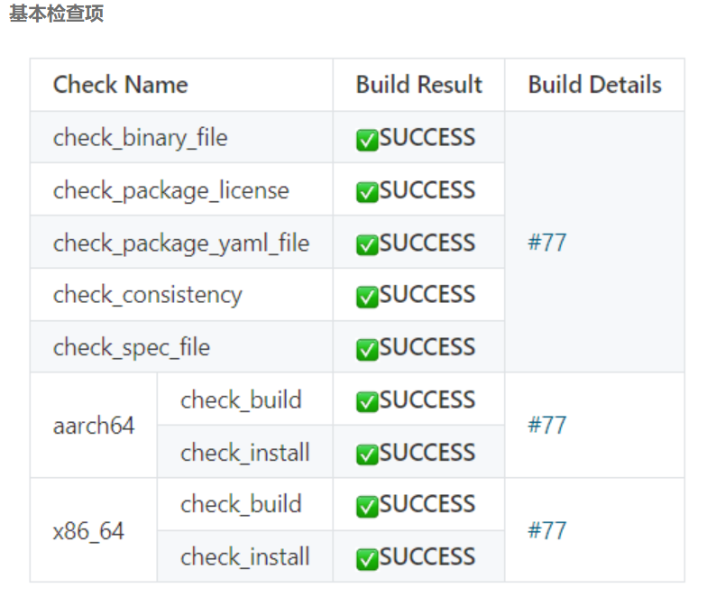
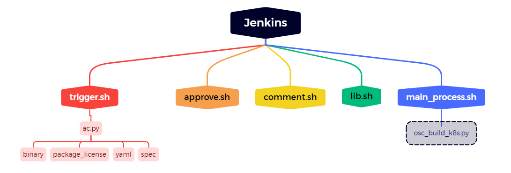
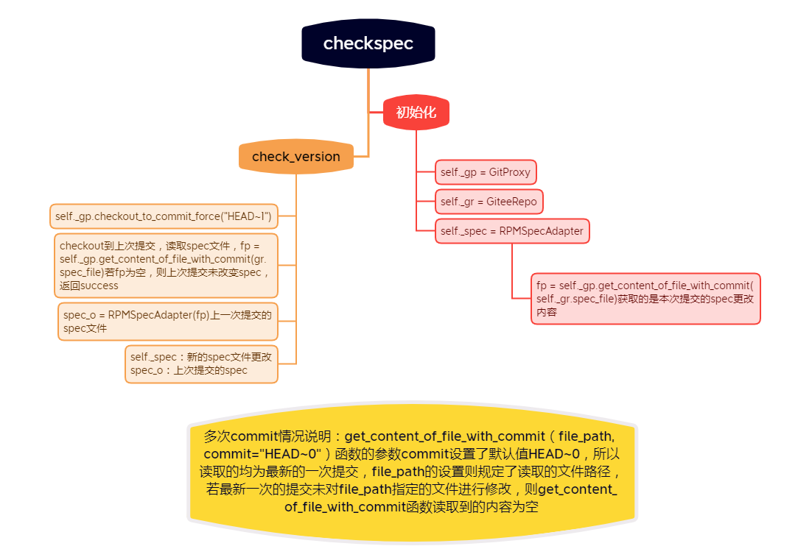
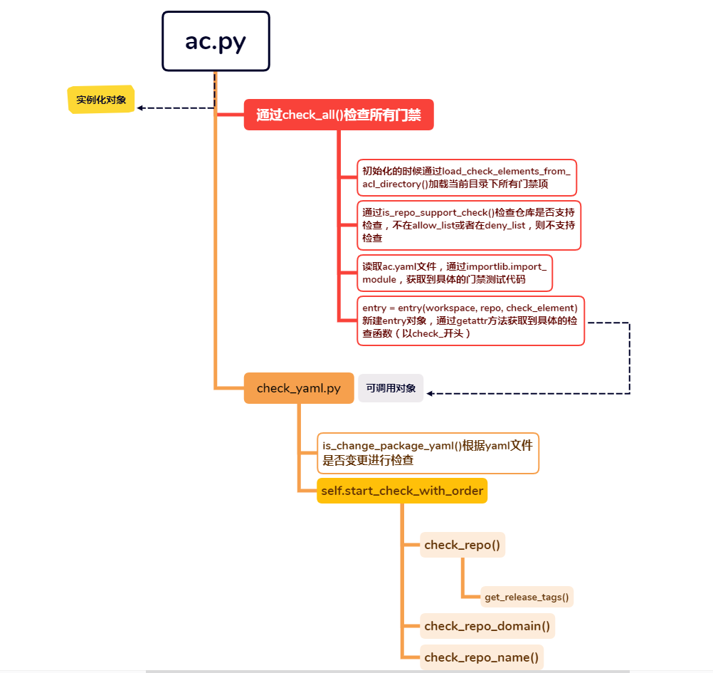

# 一、门禁功能介绍

### 1. 门禁功能
oepkgs (Open External Packages Service) 是一个为 openEuler 操作系统以及其他 Linux 发行版提供软件包服务和容器镜像服务的公共社区。为了保证软件包质量，构建者在gitee提交PR时，会自动触发门禁执行编码规范检查，最后将门禁检查结果返回到PR评论中，帮助开发者定位问题。

门禁代码开源[https://gitee.com/openeuler/openeuler-jenkins](https://gitee.com/openeuler/openeuler-jenkins)

### 2. src-openeuler 门禁检查项
#### 2.1 门禁触发方式
首次提交 PR，或评论/retest

#### 2.2 门禁开始运行标志

#### 2.3 门禁检查结果


# 二、执行流程


#### 2.1 Trigger.sh脚本

此脚本主要分为两个步骤

1、下载oepkgs源码

2、执行静态检查（license，spec等）

ac.py文件主要在第二步中执行

```shell
function exec_check() {
  log_info "***** Start to exec static check *****"
  export PYTHONPATH=${shell_path}
  python3 ${shell_path}/src/ac/framework/ac.py \
    -w ${WORKSPACE} -r ${giteeRepoName} -o acfile -t ${GiteeToken} \
    -p ${giteePullRequestIid} -b ${giteeTargetBranch} -a ${GiteeUserPassword} \
    -x ${prCreateTime} -l ${triggerLink} -z ${jobTriggerTime} -m "${comment}" \
    -i ${commentID} -e ${giteeCommitter} --jenkins-base-url ${jenkins_api_host} \
    --jenkins-user ${jenkins_user} --jenkins-api-token ${jenkins_api_token}
  log_info "***** End to exec static check *****"
}
```

#### 2.2 spec

**check_spec.py**



| 类方法/属性               | 描述                         | 作用说明                                  |
| ------------------------- | ---------------------------- | ----------------------------------------- |
| __init__                  | 初始化                       | CheckSpec实例化对象，初始设置一些参数值   |
| _only_change_package_yaml | 判断是否更改了yaml文件       | 如果本次提交只变更yaml，则无需检查version |
| _is_lts_branch            | 判断是否是lts分支            |                                           |
| check_version             | 检查版本信息                 | 检查当前版本号是否比上一个commit新        |
| check_homepage            | 检查spec文件中的主页url      | 检查主页是否可访问                        |
| check_patches             | 检查spec中的patch            | 检查spec中的patch是否存在                 |
| check_changelog           | 检查changelog中的日期错误    |                                           |
| _ex_exclusive_arch        | 保存spec中exclusive_arch信息 |                                           |
| _ex_pkgship               | pkgship需求                  |                                           |
| _parse_spec               | 获取最新提交的spec文件       | 解析changelog内容                         |
| __call__                  | ·                            | 使CheckSpec的实例对象变为了可调用对象     |

#### 2.3 binary

**check_binary_file.py**


检查压缩包中的二进制文件

| 类方法/属性                         | 描述                     | 作用说明                                      |
| ----------------------------------- | ------------------------ | --------------------------------------------- |
| __init__                            | 初始化                   | CheckBinaryFile实例化对象，初始设置一些参数值 |
| BINARY_LIST                         | 二进制文件后缀集         |                                               |
| check_compressed_file               | 解压缩包                 |                                               |
| check_binary                        | 检查二进制文件           |                                               |
| _upstream_community_tarball_in_spec | spec指定的上游社区压缩包 | 检查spec指定的上游社区压缩包                  |
| _get_all_file_suffixes              | 获取文件夹中文件后缀     | 获取当前文件中所有文件名后缀,并判断           |
| __call__                            | ·                        | 使CheckBinaryFile的实例对象变为了可调用对象   |

#### 2.4 license
**check_license.py**
**license分为三种：**

Not Free Licenses -> black
Free Licenses -> white
Need Review Licenses -> need review

**最终结果：**

```
self._white_black_list = {license_id: tag, ... }
self._license_translation = {alias: license_id }
```

##### license_in_spec：检查spec文件中的license是否在白名单中

```
def check_license_in_spec(self):
    """
    check whether the license in spec file is in white list
    :return
    """
    if self._spec is None:
        logger.error("spec file not find")
        return FAILED
    rs_code = self._pkg_license.check_license_safe(self._spec.license)
    if rs_code == 0:
        return SUCCESS
    elif rs_code == 1:
        return WARNING
    else:
        logger.error("licenses in spec are not in white list")
        return FAILED
```

1.获取spec中的license信息

2.通过指定接口 (https://compliance2.openeuler.org/sca) 获取相关license信息

3.从接口返回的信息license是否在白名单内

#### 2.5 package yaml



此文件夹中包含两个python文件

**1 check_yaml.py**

检查软件包中的yaml文件

| 类方法/属性            | 描述                   | 作用说明                                                     |
| ---------------------- | ---------------------- | ------------------------------------------------------------ |
| __init__               | 初始化                 | CheckPackageYaml实例化对象，初始设置一些参数值               |
| is_change_package_yaml | 判断是否更改了yaml文件 | 如果本次提交变更了yaml，则对yaml进行检查                     |
| check_fields           | 检查fileds             | 从具体的目标分{tbranch}支下载源码及关联仓库代码，编译软件包、比较软件包差异也需目标分支参数 |
| check_repo             | 检查repo               | 检查yaml的有效性,能否从上游社区获取版本信息                  |
| check_repo_domain      | 检查repo作用域         | 检查spec中source0域名是否包含yaml的version_control,仅做日志告警只返回SUCCESS(autoconf为特例) |
| check_repo_name        | 检查repo名称           | 检查spec中是否包含yaml中src_repo字段的软件名,仅做日志告警只返回SUCCESS |
| __call__               | ·                      | 使CheckPackageYaml的实例对象变为了可调用对象                 |


# 三、trigger阶段参数列表
| 参数名               | 默认值                           | 描述                                           | 来源            |
| -------------------- | -------------------------------- | ---------------------------------------------- | --------------- |
| repo_server          | 121.36.53.23                     | repo地址，用来存储工程之间共享的文件服务器     | 自定义          |
| giteeRepoName        | repository.name                  | gitee仓库名                                    | Webhook         |
| giteePullRequestIid  | pull_request.number              | prid                                           | Webhook         |
| giteeSourceBranch    | pull_request.head.ref            | PR源代码分支                                   | Webhook         |
| giteeTargetBranch    | pull_request.base.ref            | PR目标代码分支                                 | Webhook         |
| giteeSourceNamespace | pull_request.head.repo.namespace | PR源命名空间（openeuler/src-openeuler/用户名） | Webhook         |
| giteeTargetNamespace | pull_request.base.repo.namespace | PR目标命名空间（openeuler/src-openeuler/用户名 | Webhook         |
| giteeCommitter       | pull_request.user.login          | 提交人                                         | Webhook         |
| comment              | comment.body                     | 评论内容                                       | Webhook         |
| commentID            | comment.id                       | 评论id                                         | Webhook         |
| jobTriggerTime       | comment.updated_at               | 门禁触发时间                                   | Webhook         |
| prCreateTime         | pull_request.created_at          | PR创建时间                                     | Webhook         |
| triggerLink          | comment.html_url                 | 触发门禁的评论url                              | Webhook         |
| jenkins_user         | jenkins_api_token                | jenkins api的用户名和token                     | jenkins凭证设置 |
| GiteeToken           | openeuler-ci-bot                 | openeuler-ci-bot 评论gitee api token           | jenkins凭证设置 |
| SaveBuildRPM2Repo    | jenkins凭证设置处获取            | sshkey（将打包结果保存到repo的ssh key）        | jenkins凭证设置 |
| GiteeUserPassword    | openeuler_ci_bot                 | 获取代码账号                                   | jenkins凭证设置 |